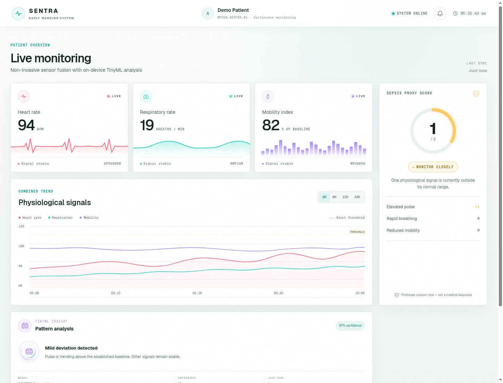
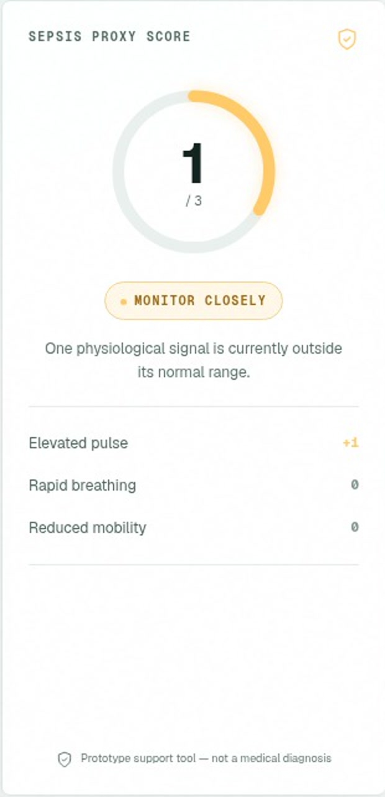
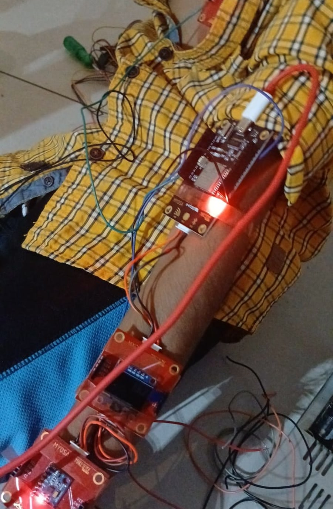
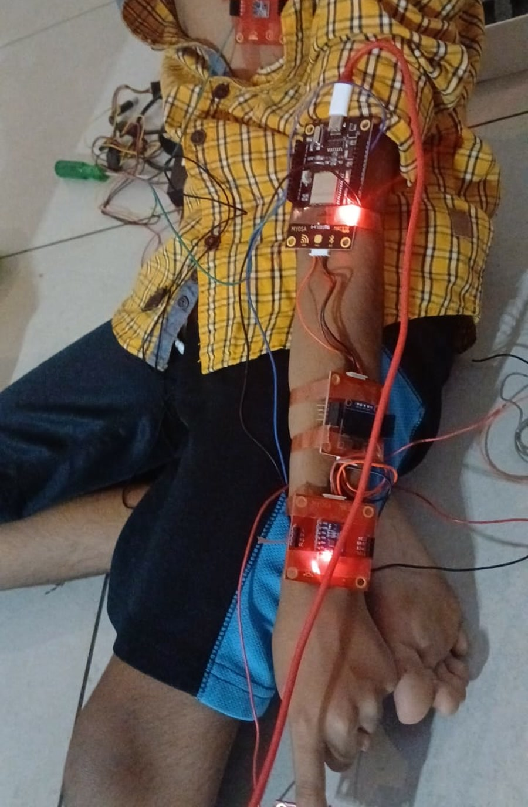
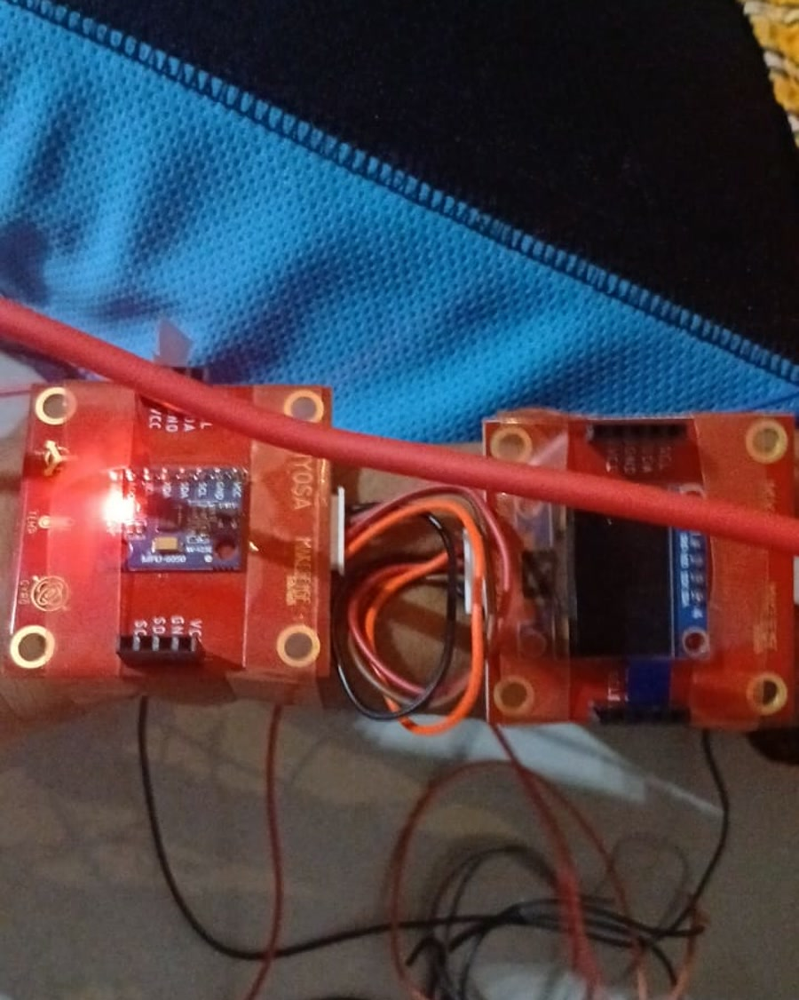

> Three accessible sensors. One clear early-warning signal.

---

## Acknowledgements

SENTRA was developed for the MYOSA project challenge using the MYOSA motherboard, an ESP32, and accessible I²C sensor modules. The project shows how affordable hardware, simple on-device analysis, and an explainable interface can make changes in a person's condition easier to notice.

SENTRA is an educational research prototype, not a certified medical device. It does not diagnose sepsis or replace professional medical assessment.

---

## Overview

Sepsis is a time-critical medical emergency. Deterioration can appear as a combination of physiological and behavioural changes, but continuous multi-parameter monitoring may be unavailable or too expensive outside well-equipped clinical settings.

SENTRA explores whether three low-cost, non-invasive signals can be combined into a simple prompt for attention. The prototype monitors:

* **Pulse trend** from reflected-light changes measured by an APDS9960 optical sensor
* **Respiratory trend** from pressure changes measured by a BMP180 sensor
* **Mobility trend** from acceleration measured by an MPU6050 sensor

The ESP32-based MYOSA board filters these signals, compares them with configured thresholds or an initial mobility baseline, and assigns one point for each abnormal trend. The resulting proxy score ranges from **0 to 3** and appears on the local OLED display. The project also includes a responsive Next.js dashboard that demonstrates how readings, signal status, score contributors, and edge-model output can be presented clearly.

SENTRA is intended for students, caregivers, community-health innovators, and researchers exploring affordable early-warning systems. Its purpose is to make multi-signal deterioration visible and explainable, not to provide a diagnosis.

**Key features:**

* Three-signal, non-invasive trend monitoring
* Transparent 0–3 proxy scoring
* Lightweight on-device logistic-regression inference
* Immediate local feedback on an SSD1306 OLED
* Responsive monitoring-dashboard prototype
* Low-cost, shared-I²C hardware architecture
* Personal mobility baseline established after startup

---

## Demo / Examples

### Images

<p align="center">
  <br/>
  <i>Responsive SENTRA dashboard showing the three monitored signals, combined trend, and proxy score.</i>
</p>

<p align="center">
  <br/>
  <i>The explainable 0–3 score identifies the signal currently contributing to the warning.</i>
</p>

<p align="center">
  <br/>
  <i>Working MYOSA/ESP32 prototype with the connected sensor and OLED modules.</i>
</p>

<p align="center">
  <br/>
  <i>Prototype placement during a supervised demonstration.</i>
</p>

<p align="center">
  <br/>
  <i>Close-up of the sensor modules mounted on MYOSA interface boards.</i>
</p>

### Videos

<video controls width="100%">
  <source src="sentra-demo.mp4" type="video/mp4">
</video>

The local demonstration video introduces the problem, explains the system architecture and sensor roles, describes the edge-analysis approach, and walks through the dashboard.

---

## Features (Detailed)

### 1. Multi-signal monitoring

Pulse, breathing, and movement can each change for many reasons. SENTRA does not treat one reading as a diagnosis. It combines three independent proxy trends so the user can see a broader picture while still understanding what caused an alert.

### 2. Experimental optical pulse estimation

The user rests a fingertip lightly over the APDS9960 optical window while shielding it from strong ambient light. The firmware samples proximity intensity at 25 Hz, removes the slowly changing background component, and detects rising peaks. Valid beat intervals are smoothed into an experimental beats-per-minute estimate.

The APDS9960 is not a medical pulse sensor, so this output is presented only as a prototype trend.

### 3. Respiratory-trend estimation

The BMP180 samples pressure at 10 Hz. When positioned in a soft wearable pressure pocket, expansion and relaxation during breathing can produce small pressure variations. The firmware removes slow pressure drift, detects repeating peaks, and smooths valid intervals into a breaths-per-minute estimate.

This approach requires physical calibration and is not equivalent to clinical respiratory monitoring.

### 4. Personal mobility baseline

The MPU6050 measures three-axis acceleration. The firmware calculates acceleration magnitude and deviation from gravity, smooths the resulting motion energy, and records a baseline during the first 30 seconds after startup. Later activity is expressed as a percentage of that baseline.

### 5. Transparent proxy score

Each abnormal trend contributes one point:

| Signal | Prototype rule | Score contribution |
| --- | --- | --- |
| Pulse trend | Heart rate above 90 BPM | `+1` |
| Respiratory trend | Respiratory rate above 22 breaths/min | `+1` |
| Mobility trend | Mobility below 50% of baseline after calibration | `+1` |

| Score | Prototype interface response |
| --- | --- |
| `0` | Continue monitoring |
| `1` | Monitor closely and recheck sensor placement |
| `2` | Display a prominent warning |
| `3` | Display the highest-priority warning |

These thresholds are demonstration defaults and must be calibrated and clinically validated before any real-world study.

### 6. On-device edge analysis

The firmware includes a compact three-feature logistic-regression calculation using normalized pulse, respiratory rate, and reduced mobility. It runs locally on the ESP32 and outputs a demonstration probability alongside the rule-based proxy score. The included coefficients are examples, not a clinically trained or validated model.

### 7. OLED output and local data endpoint

The SSD1306 OLED shows heart rate, respiratory rate, mobility percentage, proxy score, model output, and finger-contact status. When Wi-Fi credentials are configured, the ESP32 also exposes the latest values as JSON at `http://<device-ip>/data`.

The submitted Next.js dashboard currently uses simulated demo values to showcase the intended interface. Connecting it to the firmware JSON endpoint is a documented next development step.

### 8. Shared I²C architecture

All four modules use different I²C addresses, so they can share SDA and SCL without an additional multiplexer:

| Module | Role | I²C address |
| --- | --- | --- |
| APDS9960 | Optical pulse proxy | `0x39` |
| MPU6050 | Mobility sensing | `0x68` |
| BMP180 | Respiratory pressure proxy | `0x77` |
| SSD1306 OLED | Local display | `0x3C` |

---

## Usage Instructions

### Hardware setup

1. Disconnect power before changing any wiring.
2. Connect the APDS9960, MPU6050, BMP180, and SSD1306 OLED to the shared 3.3 V I²C bus. The supplied ESP32 firmware uses GPIO 21 for SDA and GPIO 22 for SCL.
3. Keep all modules on a common ground and verify that every module is 3.3 V compatible.
4. Place the BMP180 in the soft pressure pocket and secure the MPU6050 to the wrist or torso.
5. Keep the APDS9960 optical window accessible for fingertip sampling and shield it from strong ambient light.
6. Power the system and maintain normal activity during the 30-second mobility-baseline period.
7. Confirm the readings and sensor state on the OLED or Serial Monitor.

### Run the dashboard

```bash
git clone https://github.com/diplodoculass/Sentry.git
cd Sentry
npm install
npm run dev
```

Open `http://localhost:3000` in a modern browser.

### Configure and upload the firmware

1. Open `firmware/sentra_esp32/sentra_esp32.ino` in Arduino IDE.
2. Install the libraries listed under Requirements / Installation.
3. Select the correct ESP32 board and serial port.
4. Optionally enter Wi-Fi credentials in `WIFI_SSID` and `WIFI_PASSWORD`; leave them empty for offline operation.
5. Upload the sketch and open Serial Monitor at `115200` baud.

> **Safety note:** SENTRA is for education and prototyping only. Do not use its output to diagnose, exclude, or treat sepsis. Suspected sepsis requires immediate assessment by qualified medical professionals.

---

## Tech Stack

* **MYOSA motherboard / ESP32** — sensor sampling, signal processing, scoring, and local web endpoint
* **APDS9960** — reflected-light pulse proxy
* **BMP180** — pressure-based respiratory proxy
* **MPU6050** — accelerometer-based mobility tracking
* **SSD1306 OLED** — local output and alerts
* **Arduino C++** — embedded firmware
* **Next.js 16 and React 19** — responsive dashboard
* **TypeScript and CSS** — dashboard implementation and styling
* **Git and GitHub** — source control and open-source collaboration

---

## Requirements / Installation

### Dashboard requirements

* Node.js 20.9 or newer
* npm
* Git
* A modern browser

```bash
npm install
npm run dev
```

### Firmware requirements

* Arduino IDE with ESP32 board support
* Adafruit APDS9960 Library
* Adafruit MPU6050
* Adafruit BMP085 Library (supports BMP180)
* Adafruit SSD1306
* Adafruit GFX Library
* Adafruit Unified Sensor
* Adafruit BusIO

### Hardware requirements

* 1 × MYOSA motherboard with ESP32
* 1 × APDS9960 module
* 1 × BMP180 module
* 1 × MPU6050 module
* 1 × SSD1306 I²C OLED
* Jumper wires, wearable straps/pocket, safe non-conductive mounting, and a suitable power source

---

## File Structure

```plaintext
/sentra
  ├── sentra.md
  ├── sentra-cover.jpg
  ├── sentra-dashboard.jpg
  ├── sentra-score.jpg
  ├── sentra-hardware.jpg
  ├── sentra-sensor-placement.jpg
  ├── sentra-sensor-modules.jpg
  └── sentra-demo.mp4
```

Project source: [github.com/diplodoculass/Sentry](https://github.com/diplodoculass/Sentry)

---

## License

SENTRA is released under the MIT License for educational and research use. The software and documentation are provided without medical certification or fitness for clinical use.

---

## Contribution Notes

Contributions are welcome through GitHub issues and pull requests. Useful next steps include connecting the dashboard to the live `/data` endpoint, collecting consented benchmark data, improving motion and breathing artefact rejection, testing safer wearable mounting, and evaluating the prototype with qualified clinical and biomedical-engineering reviewers.
